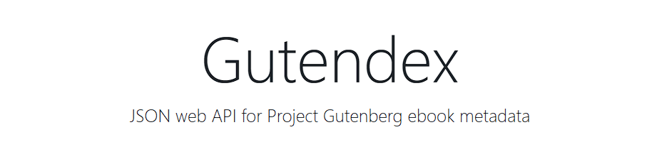

<h1> CHALLENGE LiterAlura </h1>

<h2 align="center"> Descripcion del proyecto: </h2>

 Este es un proyecto en el cual aprendi e hice uso tanto de consumo de APIS como conexion con Bases de datos. Utilizando la consola se creo una interfaz en la cual el usuario logra acceder mediante la Api a una biblioteca virtual, con esta conexion realizada se consulta por titulos de libros y esos mismos se guardan en la base de datos para luego ser llamados y consultados

## API Usada 

## Menu de la interfaz 

 En el menu podemos observar diferentes opciones las cuales nos permiten: 

 
1 - Buscar un libro por titulo

 
2 - Devolver desde la base de datos todos los libros cargados en esta misma

 
3 - Devolver desde la base de datos los autores que esten cargados en la misma

 
4 - Devolver y mostrar desde la base de datos los autores filtrados por un año determinado

 
5 - Devolver y mostrar desde la base de datos los libros filtrados por un año en especifico

 
## Tecnologias utilizadas 

<h6 align="center"> Realizado por Lautaro Fernandez Esposito </h6>

